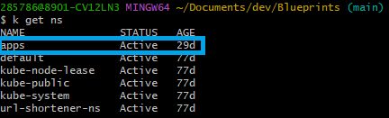

# Side Car Container and Use Cases


## Prerequisites
- Understanding one of the most Sidecar container [Architectures](https://carmax.sharepoint.com/:b:/s/HCSCloudTeam/EagVIbDXHWVHu0a347Yox1ABCXvULle3gz8tj6IcMLY1wA?e=ZXxbCl) 
- Familiarity with Kubernetes CLI
- Kuztomization File Syntax (YML)
- Access to a Kubernetes Cluster
  - AKS Cluster [(AKS Cluster Tech Primer)](https://github.com/CarMax-Internal/AKS-Cluster-Deployment)
  - Local Kind Cluster [(kind Cluster Tech Primer)](https://github.com/CarMax-Internal/kind/tree/main)


## Assumptions
- For those with minimal Kubernetes knowledge, this could be overwhelming based on prerequisites. Once 
prerequisites are better understood, please read through to better understand the very powerful Kubernetes 
Sidecar container tool. 


## Instructions

A Sidecar container both conceptually and in practice are by definition a parallel deployed service solution.

What we mean by this is that a containerized service is installed adjacent to the main container service offering.
In essence, a similar comparison can be drawn between two system level processes on one instance. In Linux, this
would be something similar to PID's within the same machine instance or container pod.

A Kubernetes pod is defined as: "the smallest deployable units of computing that you can create and manage in Kubernetes"
[(Kubernetes Pods)](https://kubernetes.io/docs/concepts/workloads/pods/).

- 

Taken from this diagram above, we will be deploying a Sidecar solution within a containerized app.

You can correlate a Venn Diagram solution where you have a circle within another circle. And each umbrella circle can
have multiple circles within. However, you should try to avoid sub-circles within other sub-circles in the umbrella 
circle. This is a common procedure that could cause issues for those without advanced knowledge known as
Docker in Docker.

- 

Again, for advanced users only, a docker in docker container is possible. However, caution still should be used as there
is most likely a more appropriate solution for the use case. Example:

- 


For our most common use case and deliverable of a Sidecar container, an authorization or logging mechanism 
is usually the default.

With this example, we will be deploying, we'll show logging exports with timestamps so we can visually see the 
sidecar container working on a live deployment.

First, refer to the kustomize.yml file. The syntax shows two containers named: "main-application", and 
"sidecar-container". The reason for naming convention is to explicitly show to the user which container is which.
The "sidecar-webapp" is a service which hosts the networking components of said container solution. This will be 
how the user accesses pod via browser.

Architecture we will be deploying (also linked under Prerequisites section above):
- 

First login to your Kubernetes cluster either locally using 
"[kind - Tech Primer](https://github.com/CarMax-Internal/kind/tree/main)" or a deployed AKS cluster
following
"[AKS-Cluster-Deployment](https://github.com/CarMax-Internal/AKS-Cluster-Deployment)".

Once logged into your cluster, make sure you are in your preferred namespace by showing currently available
namespaces with:

```shell
kubectl get namespaces
```
or shorthand:
```shell
kubectl get ns
```

For example, we use an "apps" namespace for our demos and tech primer examples.

- 

Now that you are logged in and have verified correct namespace, navigate to the directory with your kustomize file.

- 

Then go ahead and apply the file to your namespace! This will tell the kubernetes api server to grab the local
kustomize file, build the declared Pod and Service, then deploy them as Pod Containers within your namespace and 
expose the Pod via Kubernetes control plane and networking services. Kubernetes does a lot of the heavy lifting for you. 

Your service and pod will show created instead of configured and unchanged.
- 

Afterward, you will be able to review details of your Pod using the describe feature of the Kubernetes CLI.
- 

Next confirm deployment with viewing Pod, Service, and containers.

- 

- 

Lastly, you can view the working sidecar container and cat the log output service by exec'ing into the pod itself!

Use this command if you are on a windows machine, 
```shell
winpty kubectl exec -it sidecar-webapp -c sidecar-container -- sh
```


or if you are on a Mac use:
```shell
kubectl exec -it sidecar-webapp -c sidecar-container -- sh
```

- 

Congratulations! You have now deployed two containers, one main nginx application and a sidecar container running
two system services of running an access log file and a continually updating timestamp file.


### Further Reading
- [Kubernetes Sidecar](https://kubernetes.io/blog/2023/08/25/native-sidecar-containers/)


### Points of Contact
- Author: KPaaS Dev Team
- Support: Trevor Jaskot
